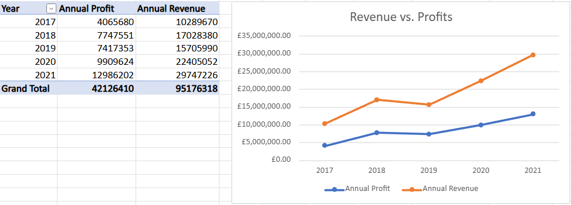
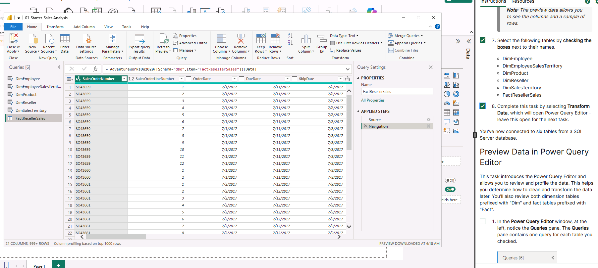
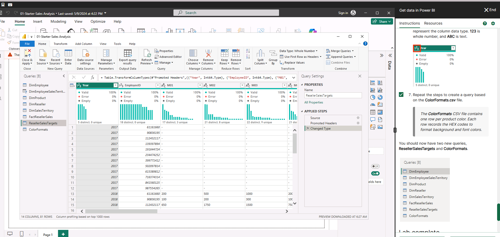
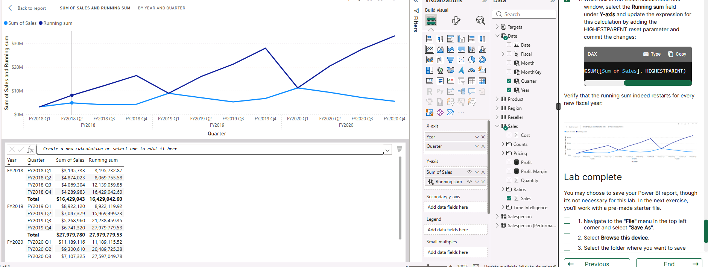
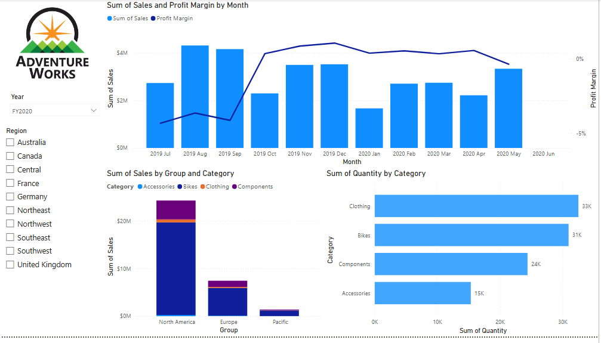

# :wave: Hi, I’m Samantha

I’m learning data analytics and building projects in Python, SQL, and visualisation tools to develop practical, job-ready skills. My background is in Literature and Cinema, combining storytelling with data to turn insights into meaningful narratives.

# :file_folder: Projects
## :bar_chart: Excel and data basics

  
 With the given dataset which shows KPIs from bike sales, I created pivot tables and a stacked bar chart to visually show my findings. The results show that the most profitable market is Australia, with a total of 63 sales, and that there are consistent sales within each age group and gender. Across all countries and age groups, female customers purchase more than male customers. The youth age category (under 25) have the least amount of sales (27). 

## :snake: Python / Google Colab 
[Python Coding](student.ipynb)
This project demonstrates my use of Python for data analysis within a Jupyter Notebook environment (Google Colab). I worked with datasets to clean, explore, and analyse data, applying core data analysis techniques in Python. For this project, I loaded a student dataset to explore and understand the structure, cleaned missing or inconsistent data, and extracted meaningful insights through the visualisations. By grouping and filtering the data, I was able to add a column for 'Grades' and analyse even further. 

## :card_file_box: SQL / MySQL Workbench 
This project focused on relational data using the MySQL World dataset, which focuses on real-world analytical queries. I wrote and tested a range of SQL queries to understand how to extract, transform, and analyse structured data efficiently. I learned how to use:
- Joins
- Aggregations
- Subqueries
- Filtering / WHERE / LIKE
- Grouping
- Basic DDL (CREATE TABLE, INSERT, UPDATE)
  View SQL script: [queries.sql](queries.sql)
 

**Database Schema ERD Diagram**
  
  This diagram shows the relationships between the tables in the MySQL World dataset, including country, city, and countrylanguage. The ERD helped me understand how tables are connected through primary and foreign keys, which allowed me to write more accurate JOIN queries and analyse relational data effectively.

## :bar_chart: Tableau

 The GapMinder dataset contains health statistics from around the world. I was tasked with analysing trends and key information that an organisation would find useful, such as being able to quickly understand health trends and disparities across different countries and continents, visualising how health metrics vary, and how life expectancy has changed over time.
  
 This is an example of a single optional worksheet, but one I found especially important as the data gives insight into how organisations may need to implement planning in the future based on trends. 

## :chart_with_upwards_trend: Power BI
This project demonstrates a full Power BI workflow completed through Skillable labs. The aim was to develop practical skills in data preparation, modelling, visualisation, and dashboard design using Power BI Desktop.
   In this lab I imported data from an SQL database (AdventureWorks) and added the raw data into Power Query. I reviewed the initial structure and fields before moving to the next step.
   This lab focused on cleaning and preparing the dataset using PowerQuery, ready for reporting and analysis. Data types were corrected, column headers were standardised, and data quality was validated using built-in profiling tools to ensure accuracy before analysis.
   In this lab I focused on creating visual reports, resulting in an interactive dashboard that presents data clearly. For this task I focused on finding the running total (DAX), showed multiple measures on one chart, and conducted time-based analysis.
   This lab involved assembling visuals into a final cohesive dashboard, providing a high level report and summary of insights. Used a combination of visuals such as combo charts, stacked bar charts, and horizontal bar charts alongside slicers to give a well-rounded analysis.

## :handshake: Contact
- 📧 Email: samanthaross1@hotmail.co.uk
- 🔗 LinkedIn: [View my profile](https://www.linkedin.com/in/samantha-ross/)
